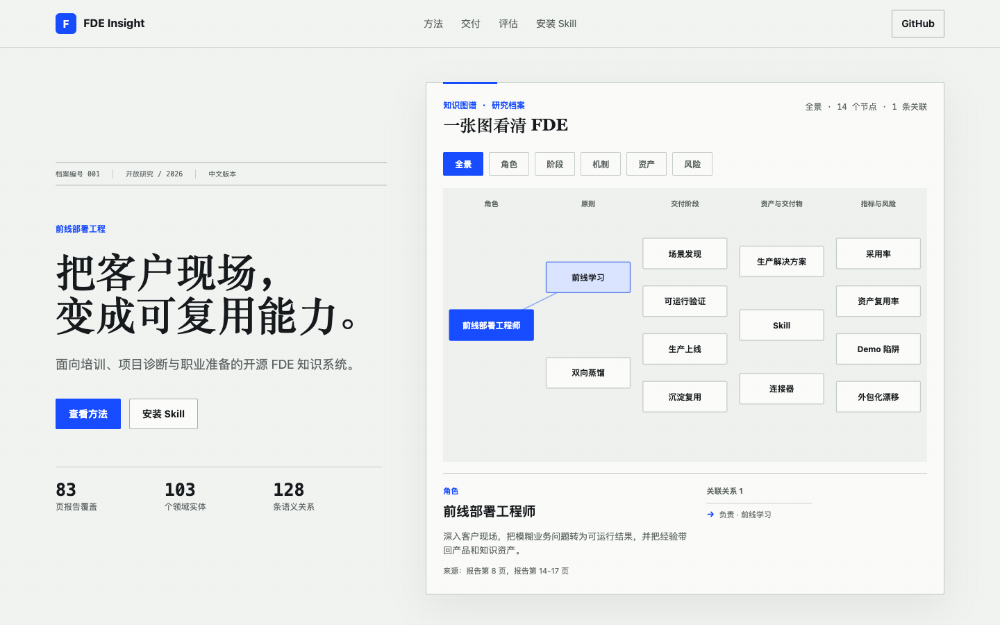

# FDE Insight

[](https://github.com/Wishyouerehere9610/fde-insight/actions/workflows/validate-and-deploy.yml)

**把客户现场的问题，变成可复用的产品能力。**

FDE Insight 是一套开源 Skill 与学习站点，用于回答前线部署工程（FDE）相关问题。内容覆盖岗位理解、客户交付、生产化、组织采用、指标设计、职业准备和可复用资产建设。

[可视化讲解](https://wishyouerehere9610.github.io/fde-insight/) · [安装 Skill](#安装-skill) · [领域 Schema](./knowledge/fde-insight.schema.json) · [证据地图](./knowledge/source-map.md)

## 可视化讲解

[](https://wishyouerehere9610.github.io/fde-insight/)

GitHub Pages 展示页与 Skill 使用同一份领域 Schema 和知识图谱。页面直接呈现角色、交付阶段、机制、资产、风险与语义关系。

| 83 页 | 103 个 | 128 条 | 10 类 |
|:---:|:---:|:---:|:---:|
| 报告覆盖 | 领域实体 | 语义关系 | 实体类型 |

## 核心能力

| 场景 | 能回答什么 | 主要资产 |
|---|---|---|
| 岗位与职业 | FDE 的职责、能力模型、面试准备和职业路径 | 角色本体、能力模型、面试 Playbook |
| 客户交付 | 如何选场景、做试点、进生产并推动组织采用 | 六阶段交付链路、退出证据、风险清单 |
| Agent 生产化 | 工具、状态、权限、评测、Trace、成本、发布与回滚 | Agent 工程检查表、生产治理规则 |
| 项目诊断 | 项目为什么停在 Demo，缺少什么生产条件 | 项目诊断 Playbook、风险与指标关系 |
| 培训与问答 | 如何设计课程、案例、练习和评分标准 | 培训 Playbook、问答协议、案例结构 |
| 资产复用 | 如何沉淀 Skill、连接器、本体、评测集和行业模板 | 复用检验、资产分类、反馈机制 |

判断一项工作是否形成 FDE 闭环，只看两件事：客户是否拿到生产结果，团队是否留下能被下一次交付直接使用的能力。

## 你可以直接问

- `FDE 和解决方案架构师、售前、驻场研发有什么区别？`
- `一个企业 RAG 项目如何从 Demo 进入生产？`
- `如何定义采用率、任务成功率和资产复用率？`
- `帮我诊断这个客户项目为什么无法规模化复制。`
- `为新入职 FDE 设计一套培训课程和案例练习。`
- `生产 Agent 除了 Prompt，还需要哪些工程能力？`

## 安装 Skill

```bash
npx skills add Wishyouerehere9610/fde-insight --skill fde-insight --agent codex --global --yes --full-depth
```

调用示例：

```text
用 $fde-insight 分析这个客户 AI 项目为什么停在 Demo，并给出进入生产的检查清单。
```

## 项目结构

| 路径 | 内容 |
|---|---|
| [`SKILL.md`](./SKILL.md) | 触发条件、资料路由、证据规则和回答结构 |
| [`knowledge/fde-insight.schema.json`](./knowledge/fde-insight.schema.json) | 领域类型、关系词表与证据约束 |
| [`knowledge/fde-insight.graph.json`](./knowledge/fde-insight.graph.json) | 103 个实体与 128 条类型化关系 |
| [`knowledge/`](./knowledge/) | 核心概念、交付阶段、角色、指标和来源映射 |
| [`playbooks/`](./playbooks/) | 问答、培训、项目诊断和面试准备方法 |
| `index.html`、`styles.css`、`app.js` | GitHub Pages 展示层 |
| [`tests/`](./tests/) | 内容、结构、来源边界和展示层校验 |

## 证据规则

| 标签 | 含义 | 回答要求 |
|---|---|---|
| **报告结论** | 有明确报告页码支持 | 给出对应来源范围 |
| **工程判断** | 根据交付机制形成的建议 | 说明前提、取舍和适用边界 |
| **待核验事实** | 可能变化的招聘、薪酬、产品或政策信息 | 重新核验当前一手来源 |
